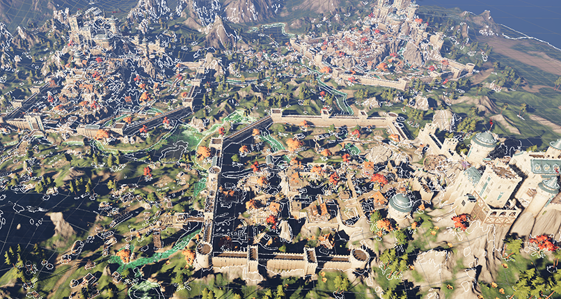

# BovineLabs Traverse

Traverse is a NavMesh, Avoidance and Movement solution for Unity Entities built on Recast/Detour.

Access and updates are provided on [Buy Me a Coffee](https://buymeacoffee.com/bovinelabs) and support on [Discord](https://discord.gg/RTsw6Cxvw3).

**Currently released as an experimental package with limited documentation and samples.**



## Quick Start

### 1. Configure Agents

Navigate to **BovineLabs** → **ConfigVar** → **Navigation** to set up:
- Multiple agent types with different sizes
- Navigation layers and areas
- Query filters for pathfinding

### 2. Create a NavMesh Surface

1. Add `NavMeshSurfaceAuthoring` component to a GameObject
2. Configure the surface properties (bounding box, cell size, etc.)
3. Choose bake mode (Scene, All, or Custom)

### 3. Add Navigation Sources

1. Add `NavMeshSourceAuthoring` components to objects that should be part of the navigation area
2. Select source type (Mesh, Terrain, Box, Sphere, etc.)
3. Set agent layers and area types

### 4. (Optionally) Bake NavMesh

For baked surfaces:
1. Select your `NavMeshSurfaceAuthoring` object
2. Click the **Bake** button
3. NavMesh data is stored in a TextAsset and loaded at runtime

For runtime generation, the NavMesh is built automatically when the scene loads.

### 5. Create Move Agents

1. Add `MoveAgentAuthoring` to a GameObject
2. To move an agent, write the destination or direction to `CrowdAgentData` and enable the `IsPathfinding` component

```csharp
public static void MoveTo(ref CrowdAgentData crowdAgentData, EnabledRefRW<IsPathfinding> isPathfinding, float3 targetPosition)
{
    crowdAgentData.TargetPosition = targetPosition;
    isPathfinding.ValueRW = true;
    // Alternatively you can walk in a specific direct instead of doing pathfinding, useful for WASD style movement
    // crowdAgentData.TargetDirection = targetDirection;
}
```

### 6. (Optionally) Setup Systems

If you using BovineLabs Essence (Stat package) this step is optional as it has built in support, otherwise you will need to implement the following 4 systems:

`AvoidanceReadSystem`, `AvoidanceWriteSystem`, `MoveApplySystem`, and `MoveProcessPathSystem`

Check the samples for an example of the implementation.

## Key Concepts

### NavMesh Surfaces

`NavMeshSurfaceAuthoring` represents a navigation mesh that agents can navigate on.

#### Baking vs Runtime

- **Baked**: Pre-computed, instant load, no runtime cost. Currently can't be modified at runtime.
- **Runtime**: Generated at startup, allows dynamic changes.

### Navigation Sources

`NavMeshSourceAuthoring` defines geometry to include in NavMesh generation:

**Source Types**:
- `Mesh`: Custom mesh data
- `Terrain`: Unity terrain data
- `MeshFilter`: From MeshFilter component
- `Collider`: From physics colliders
- `PhysicsShape`: From DOTS physics shapes
- `Box`, `Sphere`, `Capsule`: Primitive shapes

**Properties**:
- **Area Type**: Navigation area (walkable, unwalkable, etc.)
- **Agent Layers**: Which agents can use this geometry

### Agent Configuration

Agents are configured in the Navigation settings.

Entities can be assigned as an agent by Adding the `MoveAgentAuthoring` component.

### Areas and Layers

- **Areas**: Define surface properties (cost, traverse ability)
- **Layers**: Group multiple areas for easy filtering
- **Flags**: Control which areas an agent can traverse

## Performance Considerations

### Tiling Strategy

- Smaller tiles: Better for dynamic updates, higher memory usage
- Larger tiles: Better for static environments, lower memory usage

## Samples

### Installation Instructions

1. Create a new project in Unity 6.0/6.1
2. Download and import **Fantasy Kingdom in Unity 6** from the [Asset Store](https://assetstore.unity.com/packages/essentials/tutorial-projects/fantasy-kingdom-in-unity-6-urp-298128)
3. Import `com.bovinelabs.traverse` and its dependencies
4. Enable Core Extensions under **BovineLabs** → **Features**, making sure you hit **Apply**
   1. **Note**: Extensions are optional for the NavMesh but required for the sample
5. Import the samples from the Package Manager, under the **BovineLabs Traverse Samples** tab

### Baking the Terrain

Due to the large nature of the terrain, the converted terrain is not shipped with the samples and must be baked before running them:

1. Select the `TerrainNavMesh` prefab in the `Sample/Prefabs` folder
2. Click the **Bake** button
3. Wait a few seconds

This will convert the TerrainAsset into a mesh for use with the NavMesh.

### Sample Scenes

#### Baked NavMesh Scene

This scene demonstrates baking a NavMesh in the Editor and loading it at runtime.

**How to use:**
1. Load the `BakedSubScene` scene under `Sample/Scenes/SubScenes`
2. Find `NavMeshSurface` and click **Bake**
3. Once baking is complete, switch to the `Baked` scene in `Sample/Scenes`
4. Enter play mode

The baked scene should load immediately and 5,000 agents should be randomly walking around the scene.

#### Runtime Scene

This scene demonstrates baking a NavMesh at runtime.

**Location:** `Sample/Scenes/Runtime`

**Note**: Due to the large nature of the sample scene with no optimizations, it may take 10 seconds to bake at runtime.

Once built, 5,000 agents should be randomly walking around the scene.

#### NavMesh Stress Scene

This scene demonstrates continuously updating a NavMesh.

**Location:** `Sample/Scenes/StressUpdate`

#### Controller Scene (Coming Soon)

This scene demonstrates a simple click-to-move and WASD controller using the NavMesh.

#### Avoidance Stress Scene (Coming Soon)

This scene demonstrates high actor count avoiding each other.

### FAQ

**Q: I'm seeing errors in the console about "Destroy LinkedEntityGroup" or "Append Removed Component Record Error."**

A: These are known bugs in Entities and Entities Graphics related to LOD groups. Since these errors don't affect the sample functionality, you can safely ignore them.

**Q: Why is the baked terrain file so large?**

A: The terrain converts to 25 million triangles and is stored uncompressed. However, the actual baked NavMesh is much smaller as it merges and removes many redundant faces.

**Q: Will there be samples for movement and avoidance?**

A: Yes, they will be added shortly to the Baked and Runtime scenes.